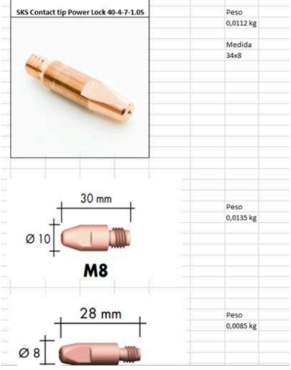
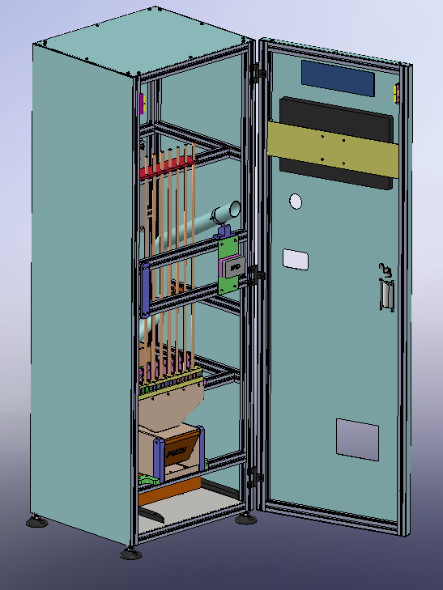
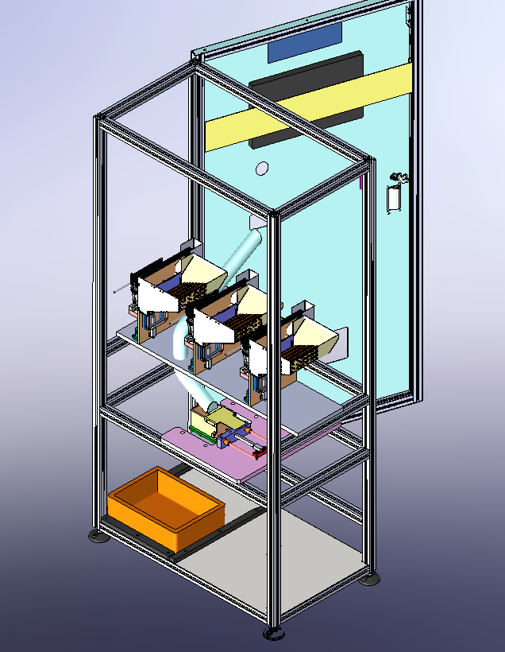

Contagem Ponteiras Soldadura 

Este projeto consiste num Dispensador de ponteiras de soldadura que identifica e separa de entre três tipos possiveis, a ponteira que foi introduzida por um usuário previamente identificado, com recurso a RFID, sistema de visao e pesagem. Consequentemente, irá disponibilizar ao usuário novas ponteiras da mesma gama e guardar as ponteiras usadas.

O sistema proposto possui o seguinte modo de operação:
- Identificação do usuário através de RFID;
- Colocação de pontas de soldagem usadas em uma entrada específica;
- Identificação das pontas de soldagem e cálculo da quantidade de pontas a serem fornecidas, através do peso da balança;
- Dispensação de pontas de soldagem;
- Possibilidade de fornecimento de pontas adicionais, através de configuração prévia no software;
- As pontas usadas são empurradas para um local de recolha, através de um atuador linear;

    
     
    <em> Ponteiras de soldadura  </em>

O sistema consiste em:
- Fornecimento de uma estrutura em perfil de alumínio e fechada com policarbonato ou equivalente, para montagem do computador, balança, dispensadores de parafuso, entre outros. Na parte traseira, haverá uma porta de acesso com fechadura, para substituição das pontas nos depósitos dos dispensadores, remoção de pontas usadas e realização de manutenção;
- Computador (Servidor) com monitor touch-screen integrado, para:
- Identificação do usuário;
- Interação do operador com o sistema;
- Possibilidade de acesso remoto, para monitorar o status operacional do sistema;
- Preparação de relatórios de dados: por data (intervalo de datas), por tipo de ponta, por operador, por linha, etc.;
- Configuração do sistema: Registro do operador, planejamento de produção semanal e diário (definindo limites de consumo por linha, operador, tipo de ponta, etc.);

 
Painel elétrico, consistindo em:
- Disjuntores de proteção;
- Interruptor diferencial;
- Módulo de entrada e saída digital, para interface com os vários componentes (Dispensadores, Atuador Linear, bandeiras);
- Estação de leitura de cartão RFID, para identificação do usuário;

 
Balança (até 1Kg e resolução de 0,1g) com comunicação serial, para:
- Pesagem das pontas de soldagem,
- Identificação do tipo de ponta,
- Cálculo do número de pontas;
- (Qt 3) Dispensadores de parafusos (padrão), para cada tipo de pontas;
- Fornecimento de um atuador linear e suporte, para remover as pontas usadas da balança;
- Depósito para armazenar pontas usadas;
  

    
     
    <em>Apresentaçao exterior do sistema </em>

Componente Elétrico / Automação:
- Fornecimento e instalação de uma caixa/quadro elétrico para a montagem de disjuntores, elementos de proteção, módulo de entradas e saídas digitais, fonte de alimentação, entre outros;
- Realização das conexões elétricas necessárias para os dispensadores e outros componentes.

    
     
    <em> Apresentação interior do sistema </em>

Componente de Desenvolvimento / Programação:
- Desenvolvimento de uma plataforma de interface do operador (conforme o modo de operação descrito no ponto 2);
- Desenvolvimento de uma plataforma de interface administrativa para configuração do sistema e visualização de dados.

    
     
    <em> Apresentação interior do sistema </em>

Componente de Hardware:
- Fornecimento e instalação de Intel NUC Server Mini PC, monitor touch-screen e leitor RFID;
- Fornecimento e instalação do módulo de entradas e saídas digitais;
- Fornecimento e instalação de 3 dispensadores de pontas de soldagem e balança de alta precisão com comunicação serial.
 

No funcionamento deste sistema teremos comunicaçoes RFID na leitura da identifcaçao do trabalhador, rs232 com a balança de pesagem. Ao computador teremos ainda ligado o sistema de visao e programa de atuaçao sobre o atuador linear responsavel pela seleçao das ponteiras na balança.

