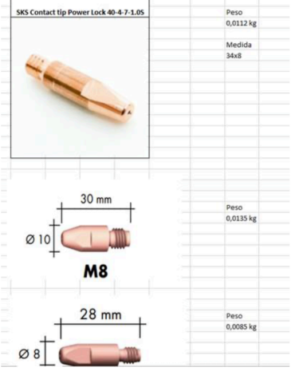
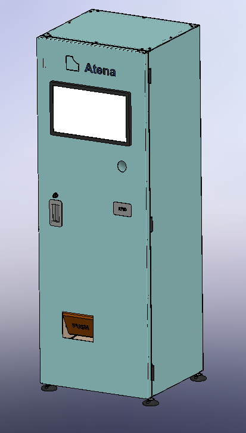
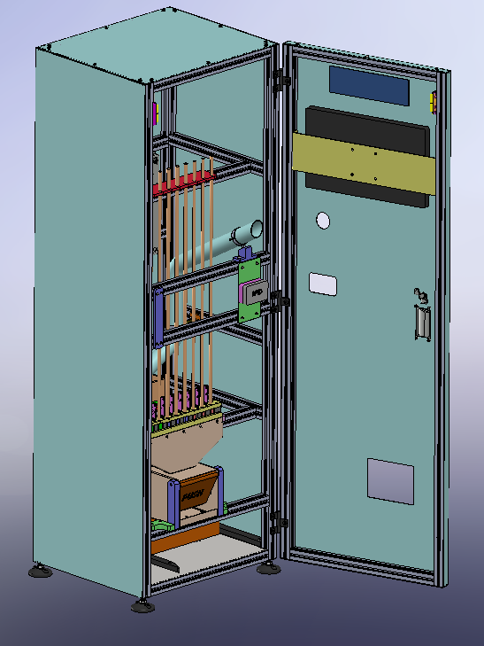
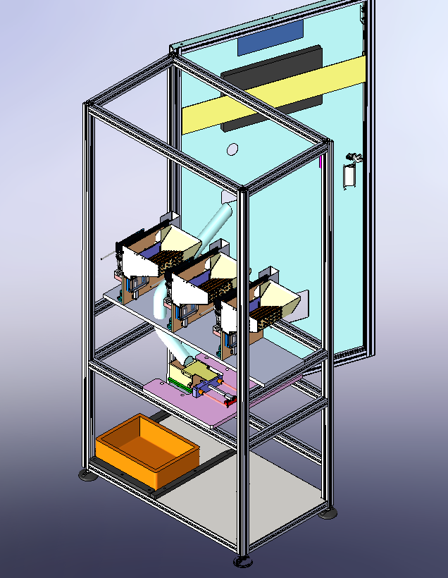

__Projeto Sistemas de Automação - Unidade curricular de Mestrado em Engenharia Mecânica da Universidade de Aveiro - 2024__

Este projeto consiste num Contador de ponteiras de soldadura que  identifica e separa de entre três tipos possiveis, a ponteira que foi introduzida, com recurso a sistema de visao e pesagem. 

Descriçao mais detalhada em [Apresentação](Apresentação/)

    
    

Projeto realizado por Nuno Seabra e Rodrigo Pinto.
